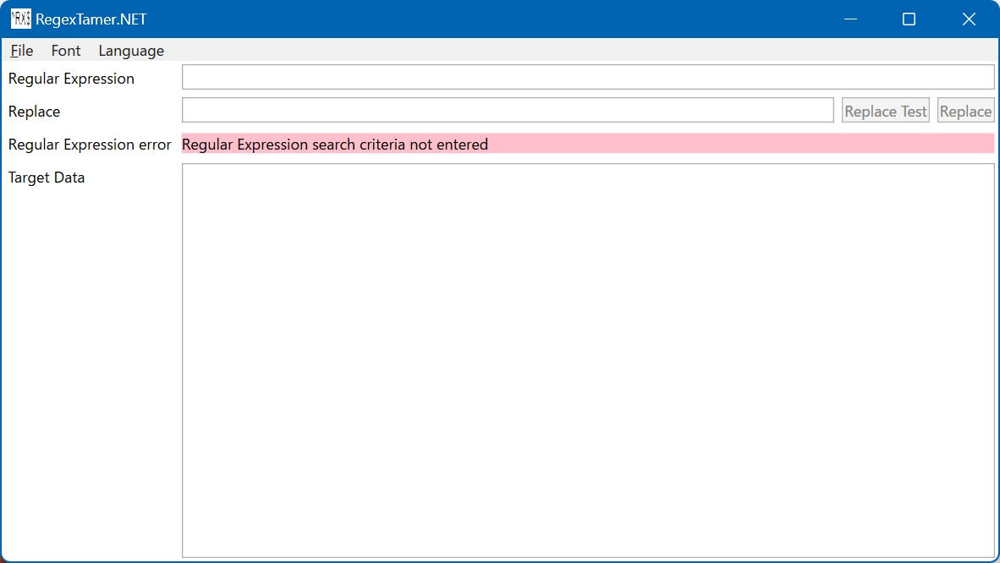
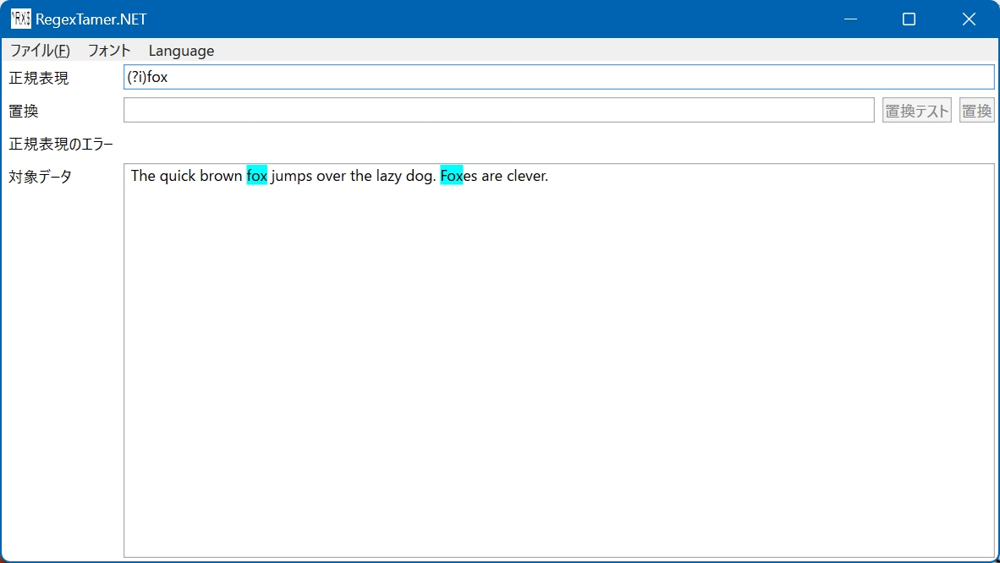
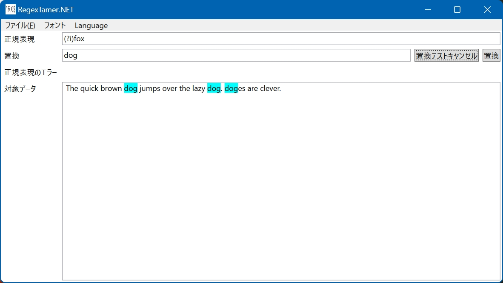

# RegexTamer.NET

[English](README.md)

## 概要

.NET の正規表現の検索と置換のテストをシンプルに行います。.NET 専用の正規表現チェッカです。

正規表現の学習は、適切な文献やサイトをご利用ください。

## 初期設定

RegexTamer.NETのZipアーカイブを展開して起動すると、以下のような画面になります。

メニュー `Language` から `Japanese` を選んでおきましょう。

## 正規表現検索

「対象データ」を以下のようにします。

> The quick brown fox jumps over the lazy dog. Foxes are clever.

そして「正規表現」を以下のようにします。

> (?i)fox

そうすると、以下のように正規表現にヒットするデータの背景に色がつきます。

## 正規表現置換

「置換」データを以下のようにします。

> dog

そして「置換テスト」を押すと、置換されて表示されます。
ここで「置換テストキャンセル」にボタンが切り替わり、これを押すと置換表示が終わります。

「置換実行」を押すと、対象データの置換が確定します。

## その他機能

メニューから、ファイルを開いたり、保存したり、フォントやフォントサイズが変更できます。
また簡易的なフォントサイズ変更方法として Ctrl キーを押しながらマウスホイールも用意しています。

## License

This project is licensed under the MIT License. See the [LICENSE](LICENSE.txt) file for details.

(c) 2024 moriyaki

