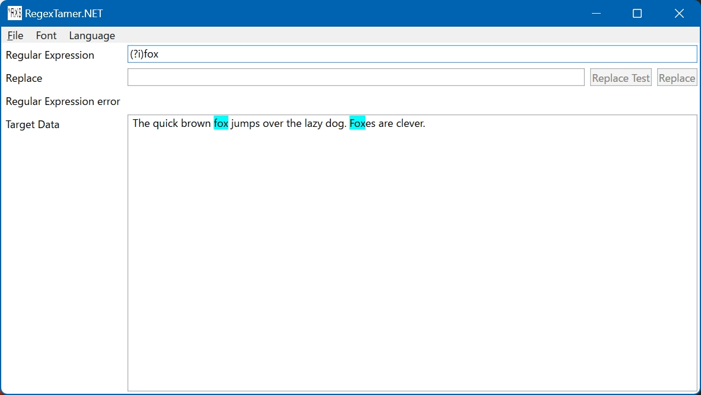
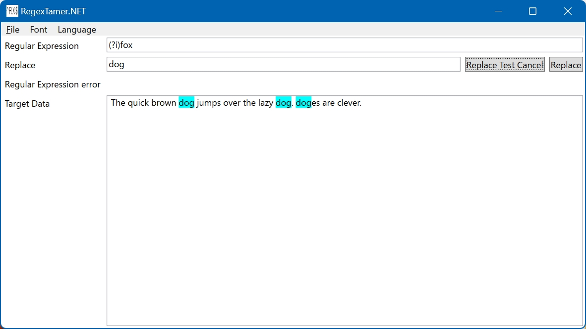

# RegexTamer.NET

[日本語](README-ja.md)

## Overview

This is a simple test for searching and replacing regular expressions in .NET. This is a regular expression checker for .NET.

Please use appropriate literature and websites for learning regular expressions.

## Initial Settings

When you unzip and run the RegexTamer.NET Zip archive, you will see the following screen.

## Regular Expression search

The “Target Data” is as follows.

> The quick brown fox jumps over the lazy dog. Foxes are clever.

And the “Regular Expression” is as follows.

> (?i)fox

Then the background of the data matching the regular expression will be colored as follows.

## Regular Expression replace

The “Replace” is as follows.

> dog
> 
Then press “Replace Test” and it will be replaced and displayed.

At this point, the button switches to “Replace Test Cancel” and pressing this button will end the replacement display.

Press “Replace” to confirm the replacement of the target data.

## Other Features

From the menu, you can open and save files, change fonts and font sizes.
A simple way to change font size is to hold down the Ctrl key and use the mouse wheel.

## License

This project is licensed under the MIT License. See the [LICENSE](LICENSE.txt) file for details.

(c) 2024 moriyaki
